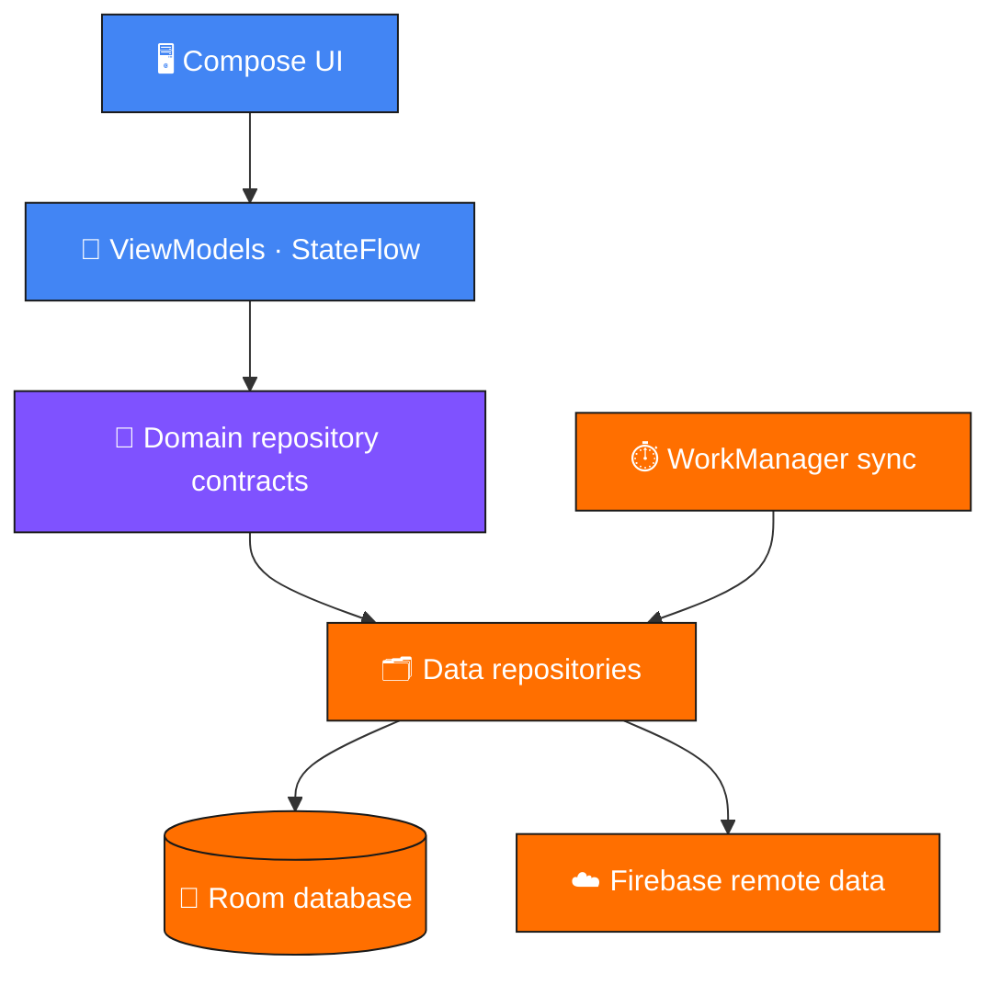

<div align="center">

# Instant Mechanic

**Find nearby garages, book a service, and talk to a mechanic on video — even with no network.**

An offline-first Android app built to explore production concerns: durable local data, background sync, real-time communication, modular architecture, and measurable performance work.

<br>


</div>

---

<div align="center">

### At a glance

| 📦 APK size | ⚡ Cold start | 🧱 Architecture | 📴 Offline |
|:---:|:---:|:---:|:---:|
| **155 MB → 69 MB** | **3,701 ms → 3,423 ms** | **3 Gradle modules** | **Full browse + submit** |
| 55.5% smaller | 7.5% faster to full display | Android-free domain layer | Queued, auto-retried |

</div>

---

## Screenshots

<div align="center">

| Home | Mechanic details | Service request |
|:---:|:---:|:---:|
|  |  |  |
| Mechanics ordered by distance | Ratings, hours, and live open/closed status | Validated request form |

| Success | Network error | Missing data |
|:---:|:---:|:---:|
|  |  |  |
| Confirmation after submission | Cached data survives a failed refresh | Graceful degradation on partial records |

</div>

---

## Features

**Discovery**
- Browse mechanics ordered by distance
- Ratings, reviews, address, working hours, services, and calculated open/closed status
- Cached listings remain browsable with no network connection

**Service requests**
- Submit requests online or offline
- Pending requests retry automatically when connectivity returns
- Form input validation

**Video consultation**
- One-to-one call with camera, microphone, camera-switching, and call controls

**State handling**
- Loading, refresh, offline, empty, success, and error states throughout

---

## Architecture

MVVM and Clean Architecture across three Gradle modules:

| Module | Responsibility |
|:---|:---|
| **`app`** | Compose UI, navigation, ViewModels, DI, Agora integration, WorkManager workers |
| **`data`** | Room, Firebase, Retrofit, DTOs, mappers, data sources, repository implementations |
| **`domain`** | Platform-independent models and repository contracts |

> [!NOTE]
> The `domain` module has **no dependency** on Android, Room, Retrofit, Firebase, or Compose — it compiles as pure Kotlin.



---

## Offline-first behavior

**Mechanic listings.** Room is the local source of truth. The UI observes database changes as a `Flow`, while a refresh fetches the latest Firebase data through Retrofit and updates the cache. Cached mechanics remain available when the refresh fails.

**Service requests.** A request is saved locally before remote submission is attempted. Failed or timed-out requests stay queued with their sync status, and a network-constrained WorkManager job retries them once connectivity is available.

---

## Video consultation

Agora RTC powers the consultation flow:

- Local camera preview and remote participant rendering
- Microphone and camera toggles, front/rear switching
- Join, leave, error, and remote-user lifecycle events
- RTC engine cleanup when the call ViewModel is cleared

> [!WARNING]
> The project uses a fixed demonstration channel and a temporary Agora token. A production implementation would issue tokens from a secure backend and add mechanic matching/signaling.

---

## Performance

### APK size

| Configuration | APK size |
|:---|---:|
| Full Agora SDK, no release optimization | 155 MB |
| **R8 + Agora Lite SDK** | **69 MB** |

**≈55.5% smaller**, via R8 shrinking and migration from the full Agora package to the Lite SDK.

### Startup

Compared against an eager-initialization build that opened Room synchronously and initialized Agora, WorkManager, and service-request dependencies during application launch.

| Implementation | Median time to full display |
|:---|---:|
| Eager initialization | 3,701 ms |
| **Deferred initialization** | **3,423 ms** |

**≈278 ms (7.5%) faster** at the median.

<details>
<summary><b>Measurement methodology</b></summary>

<br>

- 10 process-cold launches per implementation
- Same physical Android device and persisted app data
- Same debug build configuration and branded splash duration
- Launched through ADB using `am start -S`
- Meaningful UI completion reported with Compose `ReportDrawnWhen`

Absolute timings are device- and build-dependent; the percentage represents the controlled comparison on the test device.

</details>

---

## Tech stack

| Layer | Technologies |
|:---|:---|
| **Language** | Kotlin, Coroutines |
| **UI** | Jetpack Compose, Navigation Compose |
| **Architecture** | MVVM, Clean Architecture, StateFlow |
| **DI** | Hilt with KSP |
| **Persistence** | Room |
| **Background** | WorkManager |
| **Network** | Retrofit, Gson, Firebase Realtime Database |
| **Real-time** | Agora RTC |
| **Testing** | JUnit, MockK, kotlinx-coroutines-test |
| **Build** | R8 |

---

## Testing

Unit tests cover:

- Mechanic DTO-to-domain mapping
- Service-request entity and DTO mapping
- Repository submission and synchronization outcomes
- Online success, offline queuing, and retry behavior

---

## Setup

<details open>
<summary><b>Requirements</b></summary>

<br>

- Android Studio with JDK 11 support
- Android SDK 26 or newer
- Firebase Android configuration
- Agora project credentials

</details>

<details>
<summary><b>Configuration steps</b></summary>

<br>

**1.** Clone the repository and open it in Android Studio.

**2.** Add your Firebase `google-services.json` file under `app/`.

**3.** Add the following to the root `local.properties`:

```properties
AGORA_APP_ID=your_agora_app_id
AGORA_RTC_UID=1001
AGORA_TEMP_TOKEN=your_temporary_token
```

**4.** Sync Gradle and run the `app` configuration on an emulator or physical device.

> `local.properties` must not be committed. Agora temporary tokens expire and should be replaced by server-generated tokens before production use.

</details>

---

## Current limitations

| Area | Status |
|:---|:---|
| **Distance** | Supplied by the backend rather than calculated from live GPS |
| **Video** | Shared demonstration channel without production signaling or mechanic assignment |
| **Credentials** | Firebase and Agora configured for development, not a deployed production backend |

---

<div align="center">
<sub>Built to explore production Android concerns end to end — architecture, offline resilience, and measurable performance.</sub>
</div>
