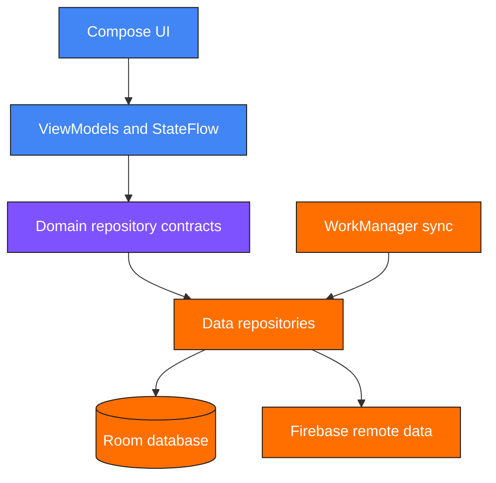

<div align="center">

# Instant Mechanic

**Discover nearby garages, queue service requests offline, and connect with a mechanic over live video.**

An offline-first Android app built to explore production concerns: durable local data, background sync, real-time communication, modular architecture, production monitoring, and measurable performance.

<br>


</div>

---

<div align="center">

### At a glance

| 📦 APK size | ⚡ Time to full display | 🧱 Architecture | 📴 Offline support |
|:---:|:---:|:---:|:---:|
| **155 MB → 69 MB** | **3,701 ms → 3,423 ms** | **3 Gradle modules** | **Browse + submit** |
| 55.5% smaller | 7.5% faster | Android-free domain | Queued and auto-retried |

</div>

---

## Demo

<div align="center">

<!-- Replace DEMO_VIDEO_URL with the GitHub-hosted video URL -->

https://github.com/user-attachments/assets/03c49695-fc52-4c10-b7e9-887d6479d9ce

<sub>Search and filtering, offline service requests, and Agora video consultation.</sub>

</div>

---

## Screenshots

<div align="center">

| Home | Mechanic details | Service request |
|:---:|:---:|:---:|
|  |  |  |
| Nearby garages and consultation | Ratings, hours, status, and services | Validated request form |

| Success | Offline state | Missing data |
|:---:|:---:|:---:|
|  |  |  |
| Submission confirmation | Cached data survives failed refresh | Graceful handling of partial records |

<!-- Replace the three URLs below after uploading the screenshots to GitHub -->

| Search and filters | Video preview | Live consultation |
|:---:|:---:|:---:|
|  |  |  |
| Search by garage or service | Preview your camera before joining | Video and audio call controls |

</div>

---

## Features

### 🔎 Garage discovery

- Search mechanics by garage name or offered service
- Switch between **Nearby** and **Open Now**
- Mechanics ordered using backend-provided distance
- Pull to refresh while retaining cached data
- Service chips with category-specific icons
- Dynamically calculated open and closed status

### 📴 Offline-first experience

- Room database acts as the local source of truth
- Cached mechanic listings remain available without connectivity
- Network refreshes update the local cache
- Existing content stays visible when a refresh fails

### 🔧 Service requests

- Submit service requests while online or offline
- Requests are saved locally before remote submission
- Pending requests retry automatically when connectivity returns
- Sync status is retained in Room
- Form validation and clear success or error states

### 📹 Video consultation

- One-to-one video consultation powered by Agora RTC
- Local camera preview and remote participant rendering
- Microphone and camera controls
- Front and rear camera switching
- Join, leave, error, and remote-user lifecycle handling

### 📈 Production tooling

- **Firebase Analytics:** tracks garage views and service requests, split by whether the request was sent online or queued offline
- **Crashlytics:** crash reporting, plus non-fatal errors from unexpected submission failures
- **Remote Config:** turns the video consultation card on or off without a new release
- **Push notifications:** Firebase Cloud Messaging notifications that open a specific mechanic when tapped
- **Deep links:** `instantmechanic://mechanic/{id}` opens a mechanic's details page directly

---

## Architecture

The app follows MVVM and Clean Architecture across three Gradle modules:

| Module | Responsibility |
|:---|:---|
| **`app`**    | Compose UI, navigation, ViewModels, dependency injection, Agora integration, WorkManager workers, Firebase Analytics, Crashlytics, Remote Config, and deep-link handling |
| **`data`** | Room, Firebase, Retrofit, DTOs, mappers, data sources, and repository implementations |
| **`domain`** | Platform-independent models and repository contracts |

> [!NOTE]
> The `domain` module has no dependency on Android, Room, Retrofit, Firebase, or Jetpack Compose.


```mermaid
flowchart TD
    UI["Compose UI"] --> VM["ViewModels and StateFlow"]
    VM --> Contracts["Domain repository contracts"]
    Contracts --> Repositories["Data repositories"]
    Repositories --> Room[("Room database")]
    Repositories --> Remote["Firebase remote data"]
    Worker["WorkManager sync"] --> Repositories

    classDef ui fill:#4285F4,stroke:#1a1a1a,color:#fff
    classDef domain fill:#7F52FF,stroke:#1a1a1a,color:#fff
    classDef data fill:#FF6F00,stroke:#1a1a1a,color:#fff

    class UI,VM ui
    class Contracts domain
    class Repositories,Room,Remote,Worker data
```

---

## Offline-first behavior

### Mechanic listings

Room is the local source of truth. The UI observes database changes as a `Flow`, while network refreshes fetch the latest mechanic data from Firebase through Retrofit and update the cache.

If a refresh fails, previously cached mechanics remain visible and the UI communicates that saved data is being displayed.

### Service requests

A service request is stored locally before remote submission is attempted. Failed requests remain queued with their current sync status.

A network-constrained WorkManager job retries pending requests when connectivity becomes available.

---

## Video consultation

Agora RTC powers the video consultation flow:

- Local camera preview
- Remote participant video rendering
- Microphone and camera toggles
- Front and rear camera switching
- Remote-user join and leave events
- Error-state handling
- RTC engine cleanup when the call ViewModel is cleared

> [!WARNING]
> The current implementation uses a fixed demonstration channel and temporary Agora token. A production version would generate tokens through a secure backend and include mechanic discovery, availability, and call signaling.

---

## Production tooling

### Analytics

| Event | When it fires | Parameters |
| --- | --- | --- |
| `mechanic_opened` | A user opens a garage's details | — |
| `service_request_created` | A request is saved | `sync_status`: `sent` or `queued` |

`sync_status` separates online submissions from ones queued offline, which shows how often users actually rely on the offline path. Incomplete forms never fire the request event, so the count reflects real requests only.

### Crash reporting

Crashlytics captures crashes automatically. The service-request ViewModel also records unexpected submission exceptions as non-fatal errors, so failures the user recovers from still show up in the dashboard.

### Remote Config

The Boolean flag `video_consultation_enabled` controls whether Home shows the consultation card. Video calls depend on a third-party SDK, so if Agora has an outage or a bad release, the feature can be switched off from the Firebase console in minutes instead of waiting for a new app release.

### Push notifications and deep links

Notifications carry the mechanic's ID as custom data (`mechanic_id`). Tapping one opens that mechanic's details page.

Deep links such as `instantmechanic://mechanic/m_01` go through the same path. `MainActivity` reads the ID and sends it through the same navigation as a notification tap, so both entry points behave identically. The activity is `singleTop`, so a link arriving while the app is already open is delivered through `onNewIntent()` instead of creating a second copy of the screen.

On a cold launch from a notification or link, the details screen collects the Room-backed mechanic list and shows a loading indicator until the data arrives. Before this fix, it briefly showed "Mechanic not found" because the screen rendered before Room had emitted.

## Performance

### APK size reduction

| Configuration | Release APK size |
|:---|---:|
| Full Agora SDK without release optimization | 155 MB |
| **Agora Lite SDK with R8** | **69 MB** |

The release APK was reduced by approximately **55.5%** by migrating from the full Agora package to the Lite SDK and enabling R8 code and resource shrinking.

### Startup optimization

Startup was compared against a deliberately eager implementation that opened Room synchronously and initialized Firebase, Agora, WorkManager-related dependencies, and service-request dependencies during application launch.

| Implementation | Median time to full display |
|:---|---:|
| Eager initialization | 3,701 ms |
| **Deferred initialization** | **3,423 ms** |

Deferred feature initialization improved median time to full display by approximately **278 ms**, or **7.5%**.

<details>
<summary><b>Measurement methodology</b></summary>

<br>

- 10 process-cold launches per implementation
- Same physical Android device
- Same persisted application data
- Same debug build configuration
- Same branded splash-screen duration
- App launched through ADB using `am start -S`
- Meaningful UI completion reported using Compose `ReportDrawnWhen`

Absolute startup timings depend on the device and build configuration. The percentage represents the controlled comparison performed on the same test device.

</details>

---

## Tech stack

| Area | Technologies |
|:---|:---|
| **Language** | Kotlin, Coroutines |
| **UI** | Jetpack Compose, Material Design, Navigation Compose |
| **Architecture** | MVVM, Clean Architecture, StateFlow |
| **Dependency injection** | Hilt with KSP |
| **Persistence** | Room |
| **Background work** | WorkManager |
| **Networking** | Retrofit, Gson, Firebase Realtime Database |
| **Real-time communication** | Agora RTC |
| **Testing** | JUnit, MockK, kotlinx-coroutines-test |
| **Build optimization** | R8, Agora Lite SDK |
| **Monitoring**              | Firebase Crashlytics, Firebase Analytics             |
| **Remote configuration**    | Firebase Remote Config                               |
| **Messaging**               | Firebase Cloud Messaging, Android deep links         |

---

## Testing

Unit tests cover:

- Mechanic DTO-to-domain mapping
- Service-request entity and DTO mapping
- Repository submission outcomes
- Successful online submission
- Offline request queuing
- Pending-request synchronization and retry behavior

---

## Setup

<details open>
<summary><b>Requirements</b></summary>

<br>

- Android Studio with JDK 11 support
- Android SDK 26 or newer
- Firebase Android configuration
- Agora project credentials

</details>

<details>
<summary><b>Configuration steps</b></summary>

<br>

**1.** Clone the repository and open it in Android Studio.

```bash
git clone https://github.com/shubhh00/InstantMechanic.git
```

**2.** Add your Firebase `google-services.json` file under the `app/` directory.

**3.** In the Firebase console, create a Boolean Remote Config parameter named `video_consultation_enabled` and publish it.

**4.** Add the following values to the root `local.properties` file:

```properties
AGORA_APP_ID=your_agora_app_id
AGORA_RTC_UID=1001
AGORA_TEMP_TOKEN=your_temporary_token
```

**5.** Sync Gradle and run the `app` configuration on an emulator or physical Android device.

> [!IMPORTANT]
> `local.properties` must not be committed. Agora temporary tokens expire and should be replaced with server-generated tokens in a production application.

</details>

**Try the deep link**

```bash
adb shell am start -W -a android.intent.action.VIEW -d "instantmechanic://mechanic/m_01" -p com.app.instantmechanic
```

**Try a push notification**

Copy the device's FCM token from Logcat. In the Firebase console, go to Messaging and send a test message with custom data `mechanic_id = m_01`. Put the app in the background, then tap the notification.

## Current limitations

| Area | Current implementation |
|:---|:---|
| **Nearby sorting** | Uses distance values supplied by Firebase rather than live device GPS |
| **Video matching** | Uses a shared demonstration channel without mechanic assignment or production signaling |
| **Agora authentication** | Uses a temporary development token rather than tokens issued by a secure backend |
| **Backend** | Firebase is configured as a development data source rather than a production deployment |
| **Push notifications**   | Sent manually from the Firebase console; no backend stores device tokens or triggers notifications |
| **Foreground pushes**    | Only FCM's automatic background display is used; notifications aren't shown while the app is open  |
| **Deep links**           | Custom URL scheme rather than verified HTTPS App Links                                             |

---
<div align="center">

<sub>Built to explore production Android concerns end to end: modular architecture, offline resilience, real-time communication, and measurable performance.</sub>

</div>
